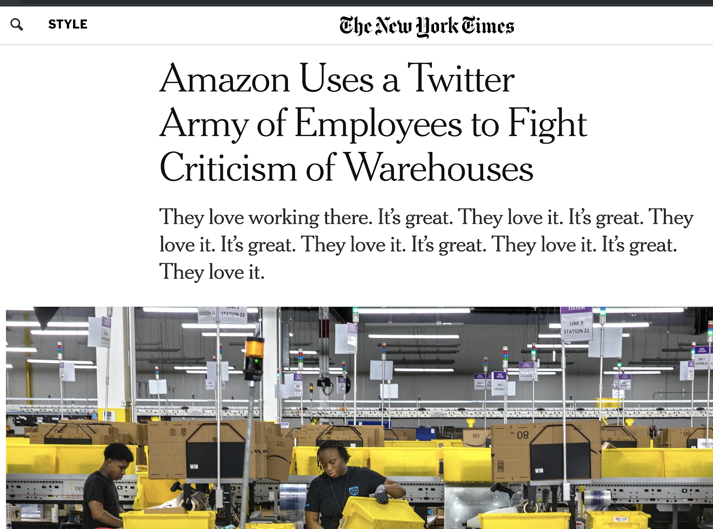

# Practical OpSec

(Based on a "Family OpSec Workshop" deck from Desmond (not his real name).)

# Introduction

## Objectives

Present an overview of the landscape of risks and protective practices across:

* Online Accounts & Passwords
* Browsers
* Internet / Websites / Email
* Phones / Tablets
* Computers
* Travel

...and also cover some "Advanced Paranoia".

## The Real Objectives

Okay, I was kidding; those aren't the objectives. These are the objectives:

* You all need to start using a password manager, and go rotate your old passwords on all your places
  * This is an ongoing process. You don't have to do it overnight, but it's something to start soon.
* You need to enable MFA on your key email accounts and your bank accounts
  * SMS MFA is better than nothing.

## The Real Objectives, Part II

From here on out, you'll:

* Always know your password to a site
* Only ever install software from a trusted app store
* Be aware of phishing emails
* Never give anyone your password to anything

And, best of all, you'll understand _why_.

## External References

Read this stuff to get more perspectives, ideas, and tools.

* <https://pack.resetthenet.org/>
* <https://www.privacytools.io/>
* <https://myshadow.org/increase-your-privacy>
* <https://decentsecurity.com>
* <https://www.eff.org/privacybadger>
* <https://cpj.org/safety-notes/>
* <https://www.phishing.org/what-is-phishing>

# Topics

* What's OpSec?
* Identity
* Threat Models
* General Advice
* Travel Advice
* Advanced Paranoia

## What's OpSec?

* OpSec is short for “Operational Security”
* Being secure in the things that you do
* Mostly security is about your personal identity and things tied to you
  * Not about hardcore cryptography or deep security topics
* Starts with the basics of how you do things everyday
* No one has perfect opsec

Let’s all be terrible together. All of today’s problems seem intractable at first. You’re not alone. We can work on them; I will help you; let’s make your opsec better one step at a time.

## Identity

* What _services_ am I registered on?
* What _identities_ of mine exist online?
* How are they _distributed_ across services I use?
* How are they _collected_? Or _shared_?
* How are they _stored_? How am _I_ storing them?
* How can I _protect_ them?
* How are they at _risk_?

## Threat Models

### Threat Modeling

Threat modeling is a way of organizing and prioritizing your various combinations of risks and defensive measures so you can make good decisions.

One good way to think of a threat model is "An _attacker_ with a _capability_ and an _objective".

### Threat Modeling: Examples

Examples of threats:

* A _Law Enforcement Officer_ with _backdoor access to your email_ who wants to _see if you are buying illegal drugs online_
* An _Organized Crime Group_ with _your personal information_ who wants to _open lines of credit in your name_
* A _Malicious Computer Program_ that can _hack your browser_ and wants to _show you ads to scam money from ad views_
* A _coworker_ who can _sneak into your office_ who wants to _snoop on your conversations with your boss_

#### Threat Modeling: Example: Ocean's Eleven

* A _ragtag group of eleven expert thieves, including a hacker, an acrobat, three con men, a pickpocket, three mechanics, and an explosives expert_, with _the schematics of your casino_ who want to _pull off the greatest heist of all time_

### Threat Modeling: Purpose

One purpose of threat modeling is to help you choose between different options based on which threats are either more likely or more damaging, such as in the question “Should I enable automatic updates?” where you must pick either Yes or No.
* “Automatic updates theoretically enable Apple/Google/LEOs to backdoor my phone/computer”
* “Automatic updates protect me against Organized Crime Groups who are trying to hack my browser”

(The correct answer is "Yes".)

### Threat Modeling: Make Good Trade-offs

The purpose of security measures is to mitigate threats.

The reality of security is that everything is a trade-off. To use any service or technology involves trusting someone or something, which is a risk. To not use a service or technology may incur risks as well.

Being more secure means doing some work, keeping track of secrets and thinking through your decisions. The amount and kind of trust you are willing to give, and the work you are capable of and willing to do should be inputs into your decision-making.

Being specific about which threats you are most concerned with, and how you can mitigate them, will help focus your efforts on realistic, achievable outcomes.

### Make Good Trade-offs

When deciding between “more safe” and “less safe”, a key question you need to answer is: "More safe from what?" More safe from one thing may be less safe from something else.

<https://twitter.com/snowden/status/1165391070726950913?s=21>

### Threat Modeling: Good Hygiene

Securing your data and resources is about more than protecting you. Attackers may target you, your data, or your devices in order to achieve an objective that does not directly harm you, such as attack someone else, launder money or stolen credit cards, send spam emails, construct a false persona online, or send anonymous threats.

The multitude of possible threats will break down into a much shorter list of good practices you can adopt, and these good practices are like good hygiene. Good hygiene helps everyone; it doesn’t just help you.

*Lots of weird possible scams may use your identity without directly harming you.*

### Threat Modeling: Breaches

Realistically, the greatest threat to your personal information is also the one you have the least amount of control over: *breaches*.

A “breach” is a data compromise that exposes data stored by a third party. Data breaches can be huge, potentially affecting hundreds of millions of people at once. This data can include all your personal information, credit history, passwords, email, online dating activity; *anything* stored on a remote system.

Breaches happen because companies are *lazy*. Breaches are not your fault. You can limit your exposure to them, though.

Read more: <https://enterprise.verizon.com/resources/executivebriefs/2019-dbir-executive-brief.pdf>

A number of account security and other practices we’ll cover help to mitigate the effect of breaches on you. (Most notably, [HIBP](https://haveibeenpwned.com/) and using a password manager.)

### Threat Modeling: Squirrels

Not every attacker is a person with intent to harm. Even a [squirrel](https://cybersquirrel1.com/) could severely affect outcomes you care about, if that squirrel is in the wrong place at the wrong time. A lightning strike could destroy your data as quickly as any online attacker.

Some of the good hygiene practices you adopt can mitigate against these risks, too.

When you’re considering the details of each threat model, you want to be able to “zoom out” to see the big picture, to see how all your decisions could benefit you in combination with each other, so you can make the best combination of decisions.

### Threat Modeling: The InfoSec Spiral of Doom

* It is *always* possible to hypothesize a way in which an attacker could attack you.
* The more you know, the easier it is to *imagine* vulnerabilities.
* “What If” scenarios play out endlessly
  * <https://en.wikipedia.org/wiki/Evil_demon>
* Nothing is perfect
* The only guarantee is that the attack vector you obsess over will not be the one that gets you
* We still need to make *practical* decisions
  * Which are good *on average* and *in aggregate*
* Don’t get let your paranoia get on top of you – stay out of the Spiral of Doom

# General Advice

## Tier 1 Advice

This is the most crucial stuff. Definitely do this.

1. Enable Automatic Updates
2. Use a Password Manager
3. Don’t Re-use a Password
4. Stay on Top of your Account Security
5. Don’t get Phished
6. Use MFA with Key Accounts
7. Never Give Anyone Your Password
8. Only Install Trusted Applications

### Enable Automatic Updates

Software becomes more insecure as it grows older.

Modern software stacks, from the Operating System to an individual app, on computers, phones, and tablets (iPads), are complex, and have large teams of the most qualified people on the planet constantly evaluating new threats and risks, and applying better testing and tools to improve their software security every day. These people are idealistic and incredibly good at their jobs.

Keeping this stuff up-to-date on your own is real hard.

There is a counter-argument that the capability to automatically update software exposes that software to exploitation by the updating authority (Apple, Google, etc.) as well as Law Enforcement. This is theoretically true, but pragmatically, the greater threat is from all other parties (such as international organized crime).

Relying on centralized, for-profit institutions to keep software secure is like relying on the government to keep roads well-maintained. Neither is a perfect model, but we can’t achieve the same outcomes as individuals that these organizations can.

Threats from Law Enforcement will be covered later under Advanced Paranoia.

#### Threat Model: Without Automatic Updates

An _automated virus_ which can _exploit your out-of-date software with known vulnerabilities_ so it can _steal your data and hold it hostage, forcing you to pay for it_.

### Use a Password Manager

Password Managers (such as 1Password, LastPass, or Bitwarden) are encrypted personal databases which help you keep track of which passwords are in use for which sites/apps/services, and to generate new secure passwords that fit a given site’s password policy (letters, numbers, etc.).

This makes it easy to follow these rules:

* Never re-use a password (use unique passwords everywhere)
* Do not use a “common” password
  * <https://en.wikipedia.org/wiki/List_of_the_most_common_passwords>

Password Managers have different availability and features on different platforms. Some have apps for phones, some for desktop computers, some support keeping your encrypted password database in a cloud storage solution such as Google Drive. Some phones or browsers have built-in password managers.

> Specifically for So You Wanna Code students: It might be good for all of us to be on the same password maanger just so everyone can help each other. Andrew uses and recommends 1Password. If you have any questions about it or need help setting it up, he'll sort you out.

### Don't Reuse a Password

Don't reuse a password. This means don't use the same password on any two accounts.

Once an attacker gains access to a password for one site (such as Netflix), the attacker will then try that name/password combination across all other sites (such as Venmo or Wells Fargo).

Using a Password Manager will eventually fix this problem. Fixing this problem without using a Password Manager is basically impossible, because in 2020 we all have way too many accounts to memorize passwords for all of them.

This does mean going around and fixing all your old accounts where you may have re-used a password. 1Password will help you do this using its "Watchtower" auditing feature, which creates a to-do list of all your reused passwords.

#### Threat Model: Password Reuse

An _Organized Crime Group_ with _access to your password from HBO_ who wants to _try this same password against all your bank accounts_.

### Stay on Top of Your Account Security

* Ensure your email addresses in use at all your various services are up-to-date
  * Do not lose access to an email account without having a backup account already configured where you need it
    * Email accounts also probably have other email accounts as backup accounts
* Read and observe any emails which are trying to notify you of an account breach or security issue (such as password reset emails)
* If you have any old passwords at a site, it’s probably time to rotate them
* Be aware when you receive a suspicious email
  * It may indicate you are being targeted by some organization’s campaign of attacks
  * And it is just generally good to notice; it is a part of your learning process

#### Have I Been Pwned?

Sign up for [Have I Been Pwned](https://haveibeenpwned.com/) with all your various email accounts.

* HIBP will notify you if any of your logins across all your sites get hacked so you can change your password
* This is an extremely good thing
* <https://haveibeenpwned.com/>

### Don't Get Phished

“Phishing” is when someone sends you an email or calls you on the phone pretending to be some business/service/person you trust.

These emails and calls are automated; millions of them are sent per day.

Phishing emails can contain links which, if you click them on your computer or on your phone, can take control of your device and steal your data.

The simplest phishing email will just link you to a web page that looks like your bank or something, and will ask you for your password. If you share your password, then they have your password.

Read More: <https://www.phishing.org/what-is-phishing>

Example: Phishing emails can look like this!

#### Do Not Do Things Like This

#### Threat Model: Phishing

An _Organized Crime Group_ who can _write a reasonably realistic fake email_ who wants to _trick you into giving them your PayPal password_.

### Use MFA (Multi-Factor Authentication)

MFA is when you configure a site to check for something in addition to a password when you try to log in, for example, by text messaging you a code (SMS MFA).

MFA helps you protect (for example) your bank accounts so that even if your password is stolen by an attacker, they will not be able to access your accounts.

MFA has a potential downside; what happens if you lose your phone? There is a method for this called _backup access codes_. Otherwise you end up in a customer support queue.

Using U2F ("Universal 2nd Factor") for MFA is one of the better security choices you can make, but it is a little inconvenient; for example, a YubiKey: <https://www.yubico.com/solutions/fido-u2f/>

Some more info on MFA from Google:

What it looks like when you log in using MFA on Google:

**TODO: Fill this in with a redacted screenshot**

#### Threat Model: Without MFA

An _Organized Crime Group_ with _access to your bank account password_ who wants to _transfer all your funds offshore_

### Never Give Anyone Your Password

* Some attackers will try to get your password by just asking you for it
* You can trust *me* with your password
  * But I’ll never ask you for it
  * That’s why I’m trustworthy
* Maybe sharing your HBO password is OK
  * Not if you re-use the same password anywhere else
* Just never give anyone any of your passwords though

### Only Install Trusted Applications

* “Ransomware” refers to hostile computer programs which will steal, destroy, or hold your data hostage
  * Almost always, these programs can only hurt you if *you* install them
  * So… *Don’t install them!!!!!*
* Modern operating systems have _trusted app stores_ where applications have been reviewed and scanned for safety and the contents of the applications have been cryptographically signed to attest to the safety of the program
* Use the app store!!!!!
* Never install programs (or browser extensions) straight from the internet!

#### Threat Model: Untrusted Applications

A _malicious software program_ which is _installed by you on your computer_ who wants to _shower you with ads, steal your data, mine Bitcoin, pretty much anything_

## Tier 2 Advice

This advice is also important:

1. Be Aware of Your Privacy Settings
2. Keep Phones & Computers Locked
3. Use Disk Encryption
4. Use GMail
5. Use an Encrypted Messaging App
6. Avoid Disinformation / Disable Ad Personalization

### Be Aware of Your Privacy Settings

* Always select the most restrictive privacy settings for any app you install
  * For example, Yelp does not need access to your Location or your Contacts
    * Well, arguably location is helpful. But you might not want to make that trade-off
* For any social media site you belong to, review your privacy settings
  * And, where possible, disable personalization in ads
  * <https://www.facebook.com/help/325807937506242>
  * <https://newsroom.fb.com/news/2019/09/update-face-recognition>
* Check your privacy settings and authorized apps across all of your Google accounts
  * <https://myaccount.google.com/security>
* You can configure your browser to improve your privacy
  * I’m happy to walk through this with you
* This applies to traditional (non-internet) businesses too
  * Every business has data sharing policies. Be aware of what they are. But also, be aware that there has never been very much you can do about this.

### Keep Phones & Computers Locked

* Never give anyone your phone when it is unlocked, or access to your computer when it is unlocked
* Never leave your phone or computer unattended when it is unlocked
  * This “Never”-type advice is pretty extreme but it’s how I operate
* Configure phones and computers to auto-lock after some number of minutes
  * Maybe at home it is safe to leave your computer unlocked as long as your house is locked
    * But probably not
* A simple policy is easiest to remember and make a habit of. "Always lock it" is a simple policy.

In this story, the victim gave a stranger her phone for a very brief period of time.

See also:

* <https://twitter.com/__apf__/status/1169321960343392256?s=21>

### Use Disk Encryption

Disk Encryption is an option you can enable in the Operating System configurations on your computer. In some operating systems, like recent versions of macOS, it is enabled by default.

Because using disk encryption will prevent your data from being recovered in the event of a drive failure, using disk encryption means you should also make sure you have automated backups set up (so you never lose your data). And you should have multiple backups.

If you do not use disk encryption, then if your device is ever lost or stolen, whoever gets it can access all your data (including possibly your online accounts), _even if they don't have your computer password_!

Phones have their disks encrypted by default.

### Use GMail

GMail is a very secure email provider, and is probably the most secure free email provider. Second-tier email providers are no longer worth using for any purpose.

Having multiple personal GMail accounts for different purposes is entirely reasonable, and free (up to a limit of like ten accounts per phone number).

Your account security across many of the services you use probably transitively boils down to the level of security on your email account. (Because you can reset your password on any account using your email!) So securing your email is vital.

### Use an End-to-End Encrypted Messaging App

* [Signal](https://signal.org/) is a good example of such an app
  * <https://signal.org>
* Many modern apps are adding end-to-end encryption
* The contents of E2E encrypted messages cannot be read by anyone except the sender and the receiver (if everything works perfectly)
* Regular text messages (SMS) do not have this property; they can be easily intercepted, stored, read, and scanned while they are in transit
  * This is especially true on much older phones, although practically this may not happen often
* It is good to start using an encrypted messaging app sooner rather than later, even if you are just exchanging cookie recipes or something even more innocent
  * That way you get practice in using one correctly, and when you do start exchanging sensitive info, it's not a red flag to observers that you switched to an encrypted messaging mechanism.

### Avoid Disinformation / Disable Personalization

#### Disable Personalization

_Personalization_ is when an online service is developing a profile of you based on what content you view or engage with online.

The _goal_ of personalization is to maximize your engagement with the service by maximizing the _influence_ the service has over you by maximizing the _impact_ of each individual content item the service chooses to display to you.

This _influence_ is what ad services are selling to advertisers, and it is what has made online advertising the _largest industry on Earth_.

* TODO: Citation required for that "largest industry on Earth" claim.

Personalization is also a risk because those third party services are _creating_ information about you & _your identity_.

That information is not accessible to you, may or may not be correct, can never be deleted, and is increasingly shared & used across many non-advertising business categories (for example, insurance).

Many of the larger services (Google, Facebook, etc.) will offer you (deep in their settings) the option to _disable_ personalization & data sharing.

Do that.

Disabling ad personalization on Google:

Disabling ad personalization on Facebook:

#### Avoid Disinformation

Disinformation as a tactic came out of the Cold War, but is now being used on a variety of fronts which may seem less obviously political, such as lawsuits between corporations.

Anything is political once it exists on a global scale, or affects the movement of billions of dollars.

Your opinions matter – that’s why so much effort goes into manipulating them.

At one time, disinformation was a sophisticated propaganda concept which was really only used to target rival governments or intelligence agencies, and was either spread via state-controlled media, or deployed in specific operations to achieve a concrete goal.

Now disinformation is being deployed automatically using the internet and targets everyday people. Additionally, disinformation can be specifically *targeted* towards a specific individual, using *personalization categories* and *algorithmically generated content* (like deepfakes) to specifically support a specific *agenda*.

Disinformation can automatically be personally targeted to you using standard capabilities of modern social apps / platforms.

Generally, disinformation relies on you to believe or spread it without thinking critically about it. This is good because it means you do not need to do much work externally verifying something to see if it is untrue.

Sometimes disinformation works by defining a category or injecting some specific use of language which will affect your thinking or reasoning later. (See George Lakoff's work on "framing".)

Disinformation also works by appealing to your biases, to make you accept it automatically.

Ultimately, marketing and advertising, in their most powerful and effective forms, are selling mind control.

Until recently, the technology of advertising (such as magazine ads) were pathetic shadows of this possibility.

Unfortunately, now modern technology makes this possibility real:

* <https://www.theatlantic.com/technology/archive/2014/06/everything-we-know-about-facebooks-secret-mood-manipulation-experiment/373648/>

The best thing you can do to avoid disinformation is to *disable personalization and data-sharing* across all social media and advertising services. I can help you do this; just ask.

Anything which personalizes ads for you* is helping to identify and segment you for targeted disinformation (and other purposes).

This is also true for anything which *automatically learns* your interests.

The second best thing you can do is *be aware of The Algorithm*. Any online recommendations or algorithmically curated news or social media feed is being structured in exactly that way *for a reason*. When you look at a list or a feed online, *think about* what the motivations of the platform are. Then, consider not just the platform itself, but the motivations of any entity powerful enough to *manipulate* the algorithm or purchase its influence.

#### Disinformation: More Reading

The most awesome disinformation campaigns ever in all of history were deployed by Russia against 2012-2017, especially targeting the NSA, but also targeting freedom of speech, democracy, and social movements on all political sides and in many countries (including Brexit and the invasion of the Ukraine!). Now though, disinformation is something that all nation-states and some very large companies and wealthy individuals are using, often by exploiting algorithmic curation.

* <https://en.wikipedia.org/wiki/The_Shadow_Brokers>
* <https://en.wikipedia.org/wiki/Cyberwarfare_by_Russia>
* <https://www.houstonchronicle.com/local/gray-matters/article/A-Houston-protest-organized-by-Russian-trolls-12625481.php>
* <https://arstechnica.com/tech-policy/2019/07/report-russian-intel-started-the-seth-rich-rumor-to-cover-for-dnc-hack/>
* <https://www.theguardian.com/us-news/2019/mar/01/nra-russia-investigations-gun-lobby>
* <https://www.nytimes.com/2019/08/10/world/europe/sweden-immigration-nationalism.html>
* <https://gizmodo.com/this-is-how-youre-being-manipulated-1835853810>
* <https://www.theguardian.com/technology/2018/jul/18/facebook-data-gathered-by-cambridge-analytica-accessed-from-russia-says-mp-damian-collins>
* <https://en.wikipedia.org/wiki/Operation_Earnest_Voice>
* <https://techcrunch.com/2018/11/15/sheryl-sandberg-claims-she-didnt-know-facebook-hired-agency-behind-abhorrent-anti-soros-campaign/>
* <https://www.theverge.com/2019/2/25/18229714/cognizant-facebook-content-moderator-interviews-trauma-working-conditions-arizona>
* <https://www.newyorker.com/news/news-desk/harvey-weinsteins-army-of-spies>
* <https://www.thedailybeast.com/how-youtube-pulled-these-men-down-a-vortex-of-far-right-hate>

# Travel Advice

* Computers and phones which are carried across international borders may be subject to search or seizure by the security apparatus of either country.
  * This is true [even for Americans coming into America](https://www.theamericanconservative.com/articles/americans-rights-are-literally-vanishing-at-the-airport)
* If traveling with a laptop, it is advisable to always store it in the hotel room’s safe while you are out of the room
  * Same with your phone if you leave it behind
  * Using those safes can be a hassle though
    * You don’t want to forget the code if you use one; what happens then?
      * Probably the safe has a default backup password which hotel admin knows
        * Which means they probably aren't all that safe
* BTW, *never* charge your phone or laptop from an *untrusted* USB port
  * <https://mg.lol/blog/badusb-cables>
  * TODO: Revise this entry; it's Desmond's opinion, and Andrew is skeptical that this threat is out there in the wild much.
    * Unless you're stopping by the NSA booth at the RSA conference. Don't charge your shit there.
* You should probably have someone competent and knowledgeable in mind that you can contact if you are ever being held by the security apparatus of this country or any other country, so you can contact them for advice.
  * Pick this person and ask them about it ahead of time. By the time you're being detained, it's going to be a little late to come up with this contingency plan.

## Travel Advice: Hotel Wifi

**TODO: Fill me in!**

# Advanced Paranoia

